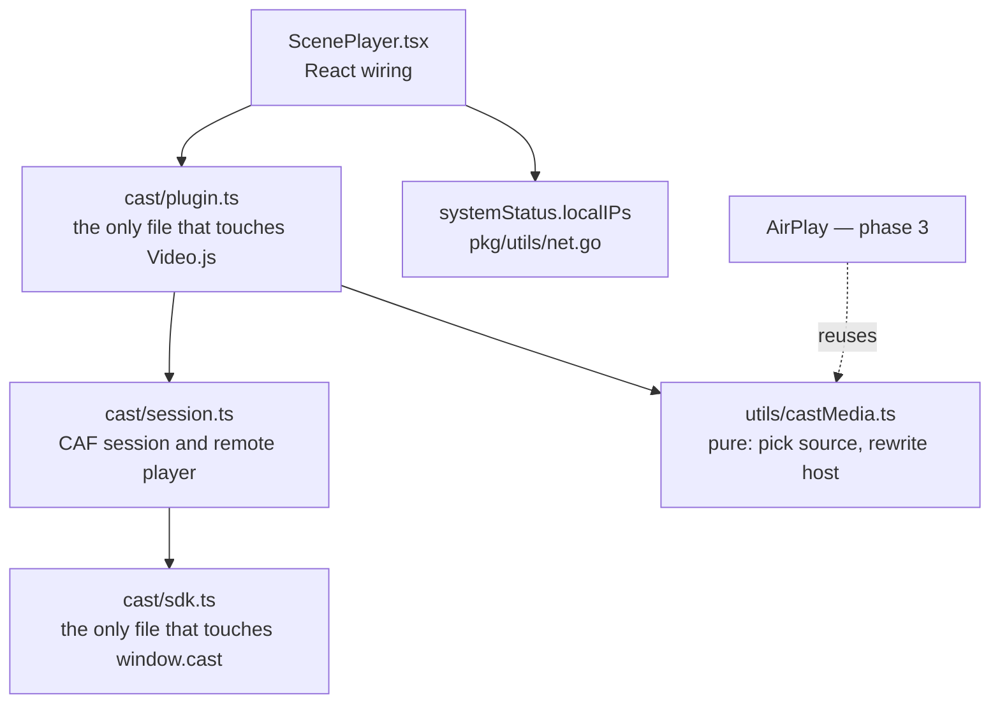
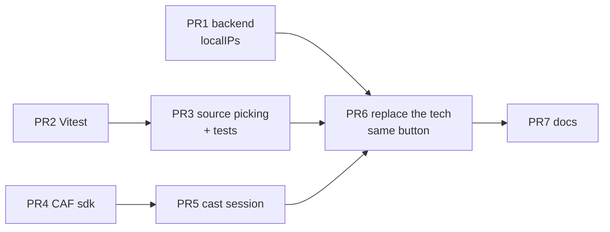

# Casting plan — Chromecast, then AirPlay

Chromecast does not work. This is the plan to make it work, in small pull
requests, starting with a fix that changes nothing a user can see.

Tracking: [stashapp/stash#4136](https://github.com/stashapp/stash/issues/4136).

---

## 1. The problem

Enable Chromecast in Scene Player options, open a scene, press Cast. The device
connects. The TV shows the Cast splash screen and stays there. Nothing plays.

There is no error in the UI. The button looks connected. People work around it
by casting from a raw IP, or by pointing their router's DNS at their own
resolver — workarounds for one of the four causes below, which is why they help
some users and not others.

## 2. Why it fails today

Four separate causes, all in shipping code. Three are ours.

| # | Cause | Evidence | Effect |
| --- | --- | --- | --- |
| P1 | The Chromecast **tech** forwards whatever the browser is playing | `ScenePlayer.tsx:373` `techOrder: ["chromecast", "html5"]`, `:383` `plugins: { chromecast: {} }`. The `@silvermine/videojs-chromecast` tech loads `player.currentSource()` onto the receiver | The dongle is asked to play the browser's stream, not a stream chosen for a dongle |
| P2 | That source is Direct stream, and **its MIME type lies** | `internal/manager/scene.go` appends `directEndpointType` first, always with `MimeMp4Video`. When the container is Matroska it adds a second endpoint, also `video/mp4`, with the comment *"use mp4 mimetype to trick the client"* | Chrome tolerates a mislabeled MKV. The Default Media Receiver does not decode MKV at all — it sits on the splash screen. **This is the hang** |
| P3 | The URL points at `localhost` | Stash is normally opened at `http://localhost:9999`, and stream URLs are built from that origin | The dongle resolves `localhost` to itself and fetches nothing |
| P4 | A custom hostname often does not resolve | Chromecast resolves names through Google DNS | A LAN-only name never answers. This is what the DNS and NAT workarounds in the issue are really fixing |

Already solved, and not part of this plan: **cookies.** A dongle carries no
session cookie. [#6529](https://github.com/stashapp/stash/pull/6529) signs
stream URLs with a prefix-scoped HMAC, so one signature covers the stream and
all its segments. Authenticated instances can already serve a cookie-less
device.

```mermaid
flowchart TD
  subgraph now["Today — hangs"]
    A1["Scene player picks<br/>Direct stream"] --> A2["Chromecast tech<br/>forwards that source"]
    A2 --> A3["http://localhost:9999/scene/42/stream<br/>Content-Type: video/mp4 (really MKV)"]
    A3 --> A4["Dongle: cannot resolve localhost,<br/>cannot decode MKV"]
    A4 --> A5["Cast splash, forever"]
  end
  subgraph next["After phase 1 — plays"]
    B1["Scene player asks<br/>the source picker"] --> B2["Device-safe MP4 or HLS,<br/>chosen from the file's real codecs"]
    B2 --> B3["http://192.168.1.20:9999/scene/42/stream.mp4<br/>signed, at a LAN address"]
    B3 --> B4["Dongle fetches and decodes"]
    B4 --> B5["Scene plays on the TV"]
  end
```



## 3. How we fix it

Three phases. Each one is useful on its own and can stop there.

| Phase | Goal | User-visible change |
| --- | --- | --- |
| **1** | Casting plays the scene | **None.** Same button, same place, same setting |
| **2** | The player controls the TV, and you can keep watching in the browser | New controls and state in the player |
| **3** | AirPlay gets the same treatment | AirPlay works from `localhost` |

### The design, in four rules

1. **Do not use a Video.js tech for casting.** Drive Google's Cast Application
   Framework from the scene player. A tech is a playback backend; casting is a
   second, independent player that happens to need our URLs. P1 is a
   consequence of pretending otherwise.
2. **Choose the source for the device, not for the browser.** Read the file's
   real codecs and container, not the endpoint's MIME type, which we know lies
   (P2). Prefer Direct stream only for H.264 + AAC in an `.mp4`, `.m4v` or
   `.mov`; otherwise the original-resolution transcode, otherwise HLS.
3. **Rewrite `localhost` to a LAN address** the backend reports, so P3 and P4
   stop mattering. The server can enumerate its own interfaces; the browser
   cannot.
4. **Keep the decision logic pure.** Source picking and URL rewriting go in a
   module with no Video.js, no Cast SDK and no DOM — the only part we can
   unit-test, and the part AirPlay reuses in phase 3.

A note the picker must respect: **endpoint labels are not a reliable key.** The
original-resolution endpoints are labelled plainly (`MP4`, `HLS`) with no
suffix; `ORIGINAL` appears in the query string, not the label. Match on
`resolution=ORIGINAL`, never on label text.

### Modules



## 4. Phase 1 — make it play, change nothing else

The success criterion is narrow on purpose: **a scene that hangs today plays on
the TV, and nobody can tell from a screenshot that anything changed.**

### Yes, the UI stays identical

The Cast button today is drawn by the `@silvermine/videojs-chromecast` package.
Dropping that package means drawing the button ourselves, so "identical" has to
be an acceptance criterion, not a hope. It means all five of these:

| What | How it stays the same |
| --- | --- |
| Position in the control bar | Same slot, immediately left of the fullscreen toggle. Verify with a before and after screenshot of the control bar |
| CSS class | Keep `vjs-chromecast-button`. Two rules in `ScenePlayer/styles.scss` already target it — one for desktop, one for the narrow layout. Neither rule changes |
| Icon | The standard Cast glyph, embedded as an SVG data URI, so the silvermine stylesheet can be dropped with the package |
| Setting | The same `enableChromecast` toggle, the same label, the same default |
| Everything else | No badge, no overlay, no change to the local video, no new controls. Those are phase 2 |

The one intentional difference: today, pressing Cast on an MKV hangs silently.
After phase 1, an unusable scene tells you why instead of hanging.

### The PR stack

Branch off `develop` as `feature/chromecast`. Every PR targets that branch. One
merge to `develop` at the end — that is how the PRs stay small without ever
shipping a half-built feature.



| PR | Title | ~Lines | Risk | Reviewable on its own because |
| --- | --- | --- | --- | --- |
| 1 | Expose this machine's LAN IPv4s in `systemStatus` | 130 | low | Pure backend addition with unit tests, in `pkg/utils` where 10 test files already live. Nothing in the UI depends on it yet |
| 2 | Add Vitest to the UI | 50 | low | Tooling only, and the one repo-wide decision here. Isolated so it can be deferred without blocking anything |
| 3 | Device-safe source picking and LAN rewriting | 250 | low | The brain of the fix — which stream we send, and at which host. Pure functions, fully unit-tested, nothing wired |
| 4 | Cast SDK adapter | 150 | low | The only file that touches `window.cast`. Loads the SDK once, hands back a context or null |
| 5 | Cast session | 120 | medium | Connect, end, load, play, pause, seek, state events. No Video.js, no React |
| 6 | Replace the Chromecast tech with a CAF session | 220 | medium | Where casting starts working. Drops `@silvermine/videojs-chromecast`, draws the identical button, and splits AirPlay onto its own setting so it stops riding the Chromecast toggle |
| 7 | Documentation | 80 | none | Why casting needs a LAN address, what the browser requirements are, what the settings do |

Every PR must pass `make validate-ui` (biome lint, `tsc --noEmit`, format check)
and `make it` (Go tests). From PR 2 onward, also `pnpm test`.

### One constraint worth knowing before PR 6

The Cast sender SDK only runs on **HTTPS or `http://localhost`**. It refuses to
initialise on `http://192.168.x.x`. So the page must be at localhost while the
*media URL* must be at the LAN address — which is exactly why the rewrite in
rule 3 exists, and why we cannot simply tell everyone to browse by IP.

## 5. Phase 2 — controls, and both screens at once

Phase 1 makes the scene play. It does not make the player useful while it plays.
Phase 2 is the UX work, and it is what makes casting fit how Stash is actually
used: **the TV is for watching, the browser stays your organising tool.**

### What it delivers

| | Behaviour |
| --- | --- |
| **Player controls drive the TV** | Play, pause, seek, skip and changing scene go to the dongle. The scrubber reflects the TV |
| **Keep watching in the browser too** | The local video keeps playing alongside the TV, muted by default so there is no double audio. Unmute for both |
| **Leaving the scene page does not stop the TV** | Navigate off to tag, organise or run a plugin, and playback continues. This is the point of the phase |
| **You can see what is happening** | Connected state on the button, and the device name in the player. Translated — no English baked into CSS |

### Design notes

- **The browser stays master.** Local playback is the source of truth and
  mirrors outward to the dongle. The alternative — the TV as master, browser as
  a dumb remote — sounds tidier and is worse: the local player then cannot be
  used for anything, which defeats the purpose above.
- **Mirroring means patching `play`, `pause` and `currentTime` on the player
  object.** That is the riskiest code in the whole plan. It gets its own PR, a
  re-entry guard so a remote update does not bounce back, and a documented
  contract at the top of the file, because Stash UI plugins can patch the same
  methods.
- **Two screens can mean two transcodes.** If the browser needs a transcode and
  the dongle needs a different one, ffmpeg runs twice. Worth measuring in PR 9
  before we call the default good.

### The PR stack

Branch off `develop` as `feature/cast-controls`, after phase 1 has merged.

| PR | Title | ~Lines | Risk | Notes |
| --- | --- | --- | --- | --- |
| 8 | Player controls drive the TV | 110 | **high** | The patching, alone, in one diff. Play, pause, seek, skip, scene change |
| 9 | Keep playing in the browser while casting | 90 | medium | Local video continues, muted by default, restored on disconnect. Measure the double-transcode cost here |
| 10 | Show cast state in the player | 90 | low | Connected button state and a "Casting to *device*" badge as a real DOM element, from the locale file |
| 11 | Documentation and settings copy | 60 | none | One pass over the manual and the setting descriptions |

### Test cases specific to phase 2

- Pause and play in the browser — TV follows
- Seek in the browser — TV follows
- Pause on the TV remote — browser pauses
- Next scene in a playlist — TV loads the new scene
- Navigate to another page — TV keeps playing
- Disconnect — browser keeps playing, audio unmutes, position holds
- Unmute while casting — sound comes from both

## 6. Phase 3 — AirPlay

AirPlay is a much smaller problem than Chromecast, because Safari never asks us
for a URL. It hands the Apple TV whatever the `<video>` element is already
playing.

| Problem | Chromecast | AirPlay today |
| --- | --- | --- |
| Session cookie | fixed by #6529 | **already fixed** by the same PR |
| MKV or unplayable codec | fixed in phase 1 | **already fixed, by accident** — `ScenePlayer.tsx:636` filters every transcode source out in Safari, so an MKV direct stream fails and the source selector falls over to HLS, which is what the Apple TV then gets |
| Cannot fetch `localhost` | fixed in phase 1 | **still broken** |
| Which format the TV gets | chosen explicitly | implicit, and usually right |

So one real bug is left, with a narrow blast radius:

> AirPlay breaks only when Stash is opened at `http://localhost` on the same
> Mac. Open Stash at `http://192.168.x.x:9999` and AirPlay works today.

### Decide this before writing code

| Option | What it is | Cost | Fixes |
| --- | --- | --- | --- |
| **A. Docs and an in-UI hint** | Say that AirPlay needs the LAN address, next to the AirPlay setting | 1 PR, ~60 lines | The confusion, not the bug |
| **B. Swap the source when AirPlay engages** (recommended) | Detect that a wireless target went active, swap the player source to the LAN-rewritten URL, restore position and play state, swap back on disconnect | 4 PRs, ~370 lines | The bug |
| **C. Always serve LAN URLs when AirPlay is on** | Rewrite the source list up front whenever AirPlay is enabled and the page is on localhost | 1 PR, ~40 lines | The bug — but everyday local playback then depends on the LAN IP staying correct |

**Ship A first as a standalone quick win, then B.** A is one small PR and
removes most of the reported pain immediately. C costs least and asks every user
with the setting on to accept a more fragile local player, for a feature most of
them never touch.

### The PR stack for option B

| PR | Title | ~Lines | Risk | Notes |
| --- | --- | --- | --- | --- |
| 12 | Per-device source profiles | 90 | low | One named profile per device instead of a boolean flag. Pure and unit-tested |
| 13 | Detect AirPlay target state | 100 | low | Wraps `webkitplaybacktargetavailabilitychanged` and `webkitcurrentplaybacktargetiswirelesschanged` into `isAvailable` / `isActive` / `onChange`. No behaviour change |
| 14 | Serve a LAN-reachable source while AirPlay is active | 120 | **high** | The only behaviour change. Swap source, restore `currentTime` and play state, refuse to swap on an HTTPS page |
| 15 | Documentation and settings copy | 60 | none | This is option A. It can ship first and alone |

Profiles:

```
chromecast: direct if H.264/AAC in .mp4 → original mp4 → hls
airplay:    hls → direct if H.264/AAC in .mp4 → original mp4
```

AirPlay prefers HLS: it is adaptive, it seeks cleanly on the Apple TV, and it is
what Apple recommends for the platform.

### Out of scope

| Item | Why not now |
| --- | --- |
| Dropping `@silvermine/videojs-airplay` for the native `webkitShowPlaybackTargetPicker` | About 40 lines and one less dependency, and PR 13 already listens to the events the plugin uses — so it gets cheap once B lands. Still a separate decision |
| Captions on the Apple TV | Text-track URLs are signed and point at `localhost` too, so subtitles need the same rewrite. Smaller bug, own issue |
| One button for both devices | Different SDKs, different failure modes |

## 7. Tests

| Area | Today | After |
| --- | --- | --- |
| Go | 114 test files, 21 against the database, 10 in `pkg/utils` | Unchanged conventions — the new `pkg/utils` code is table-tested like its neighbours |
| UI | **zero**, and no test runner | Vitest (PR 2) and `castMedia.test.ts` (PR 3) |

Adding a JavaScript test runner is the only tooling change in the plan, which is
why it sits in its own droppable PR.

**Unit tests, PR 3** — these are the cases that produce the reported bug:

- MKV labelled `video/mp4` must **not** pick Direct stream
- H.264 + AAC in `.mp4` picks Direct stream
- H.265 in `.mp4` picks the transcoded MP4
- No MP4 endpoint at all falls back to HLS
- Nothing usable returns null, so the button reports an error instead of hanging
- `localhost:9999` plus a LAN IP rewrites the host
- `localhost:3000`, the Vite dev port, rewrites host **and** port to `9999`
- A LAN or public host is left untouched
- Signed parameters survive the rewrite
- The LAN IP picker prefers a private address over a public one

**Manual, PR 6** — needs a real dongle:

| Case | Expected |
| --- | --- |
| MKV scene, press Cast | Plays on the TV. First start may take 10–30 s while the transcode spins up |
| H.264/AAC MP4 scene | Plays with no transcode |
| Scene with no usable stream | Clear error, no silent hang |
| Stash opened at a LAN address | The button explains that the Cast SDK needs HTTPS or localhost |
| Firefox or Safari | Button hidden, or it explains the browser is unsupported |
| Setting off | No button, `cast_sender.js` never loads |
| Authentication enabled | The TV still plays, via signed URLs |
| Control bar, before and after | Pixel-identical |

## 8. Risks

| # | Item | Handling |
| --- | --- | --- |
| R1 | Patching `play`, `pause` and `currentTime` (phase 2) is fragile. Video.js calls them internally, and Stash UI plugins can patch the same methods | Own PR, a re-entry guard, and a documented contract at the top of the file |
| R2 | Signed URLs expire after `signed_url_expiry`, four hours by default. A long scene left paused on the TV could outlive its signature | Confirm with a paused test past the expiry, or document it. Not a regression |
| R3 | The LAN rewrite puts the machine's private IP into a URL handed to Google's receiver | LAN-only and expected for Cast. Worth one line in the docs |
| R4 | Casting both to the TV and the browser can mean two concurrent transcodes | Measure in PR 9 before defaulting to it |
| R5 | Phase 3 PR 14 swaps the player source while AirPlay is active. Safari re-buffers and the position must be restored by hand | Own PR, behind the existing setting, only when the current source is `localhost` |
| R6 | Rewriting to `http://192.168.x.x` from an HTTPS page is blocked as mixed content | PR 14 refuses to swap on HTTPS. Covered by a unit test in PR 12 |

## 9. Sequencing

**Phase 1 — make it play**

| Day | Work |
| --- | --- |
| 1 | PR 1, PR 2 and PR 4 in parallel — no dependencies between them |
| 2 | PR 3 after the test runner, PR 5 after the SDK adapter |
| 3 | PR 6 — first end-to-end test against a real dongle |
| 4 | PR 7, then merge `feature/chromecast` into `develop` |

**Phase 2 — controls and both screens**

| Day | Work |
| --- | --- |
| 1 | PR 8 and the mirroring test cases |
| 2 | PR 9, with the transcode cost measured |
| 3 | PR 10, PR 11, then merge |

**Phase 3 — AirPlay**

| Day | Work |
| --- | --- |
| 1 | PR 15 alone as option A — docs and the hint, shipped without the rest |
| 2 | PR 12 and PR 13 in parallel |
| 3 | PR 14, then the Safari and Apple TV pass, then merge |
