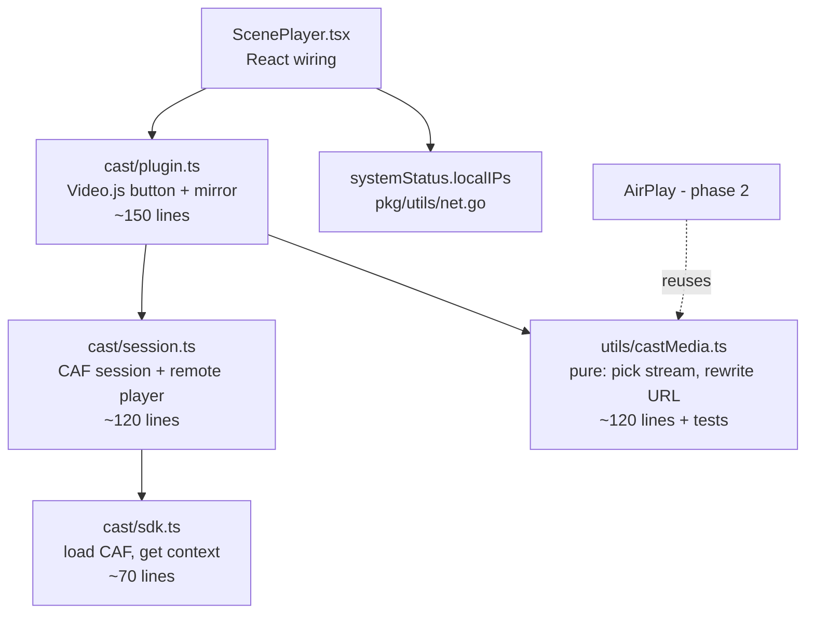
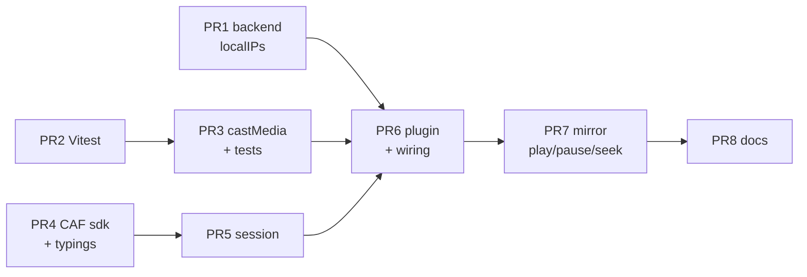

# Chromecast refactor plan

Refactor the working Chromecast feature into small, reviewable PRs.
Behaviour stays the same. AirPlay is phase 2.

**In plain words:** a Chromecast dongle fetches the video by itself. It has no
login cookie, it cannot reach `localhost`, and it cannot play MKV. The three
commits below teach Stash to hand the dongle a URL it can actually use, and
then keep the browser and the TV in sync. The code works; it just lives in one
449-line file that is hard to review or change.

---

## 1. What the three commits do

| # | Commit | What it delivers |
| --- | --- | --- |
| 1 | `34b5219d0` Cast Chromecast-safe MP4/HLS at this machine's LAN address | Drops the Video.js Chromecast *tech*, drives Google CAF directly. Adds `systemStatus.localIPs` (Go), stream picking + URL rewriting (`castMedia.ts`), the plugin (`chromecast-button.ts`), and splits AirPlay into its own setting. |
| 2 | `604e8f1a2` Control Chromecast from the scene player | Wraps `play` / `pause` / `paused` / `currentTime` so the player acts as a remote. Scene change reloads on the dongle. |
| 3 | `4c7099900` Play scenes on Chromecast and in the browser together | Reverses the model: the browser stays master and *mirrors* to the dongle. Local audio muted. Removes most of what commit 2 added. |

Commit 3 rewrote commit 2. **Do not merge the three commits as they stand** —
reviewers would read code that is already replaced. Land the end state instead,
cut by layer.

Related and already on `develop`: `d04ecc4f8` (signed URLs, #6529). Not touched
by this refactor.

## 2. Where the complexity is

| File | Lines | Jobs it does |
| --- | --- | --- |
| `ScenePlayer/chromecast-button.ts` | 449 | SDK bootstrap, Video.js button, session watching, remote player events, player API patching, media loading, error text |
| `utils/castMedia.ts` | 165 | Stream picking, URL rewriting, browser sniffing, transcode warm-up |
| `@types/chrome-cast.d.ts` | 116 | Hand-written CAF typings, now partly unused |
| `ScenePlayer.tsx` | +58 | Config wiring, ref mirroring, resume-on-scene-change |
| `pkg/utils/net.go` (+test) | 126 | LAN IPv4 enumeration — already clean and tested |

Seven pieces of mutable state live in the plugin: `connected`, `busy`,
`watching`, `wrapped`, `applyingRemote`, `loadedMediaId`, `mutedBeforeCast`.

## 3. Target shape

Rules that keep it that way:

- `castMedia.ts` stays **pure** — no `videojs`, no `window.cast`, no DOM. It is
  the only part we can unit-test, and the only part AirPlay will share.
- `sdk.ts` is the only file that touches `window.cast` / `window.chrome.cast`.
- `plugin.ts` is the only file that touches Video.js.

## 4. Clean-up list

Each item is dead code, duplication, or a hardcoded string found in the current
code. None of them change behaviour.

| # | Item | Why | Risk |
| --- | --- | --- | --- |
| C1 | `pickCastStream(streams, file, preferHls)` — `preferHls` is never passed | Dead parameter | none |
| C2 | `IStashChromecastOptions.stashPort` — never set, always falls back to `"9999"` | Dead option plumbed through 3 call sites | none |
| C3 | `/original/i.test(s.label)` in three branches **never matches** — the backend labels the original-resolution endpoint `"MP4"` / `"HLS"` with no suffix; `ORIGINAL` is in the query string, not the label | Dead branches. Today the right stream is picked only because it happens to be first in the list. Match `resolution=ORIGINAL` instead and cover it with a test | low — behaviour is identical, intent becomes explicit |
| C4 | Three near-identical `findBy(...)` + object-literal blocks in `pickCastStream` | Replace with a candidate table (~60 lines → ~25) | low |
| C5 | `originalPaused` is still captured and called, but commit 3 stopped wrapping `paused` | `this.originalPaused()` is just `player.paused()`. `unwrapPlayerApi` also restores a method that was never wrapped | none |
| C6 | `initCastSdk` chains a previous `window.__onGCastApiAvailable` handler | That existed for `@silvermine/videojs-chromecast`, which commit 1 removed | none |
| C7 | `initCastSdk(): Promise<boolean>` + `getCastContext()` + `configureCastContext()` forces the triple guard `if (!ok \|\| !castCtx \|\| !chromeCast)` in two places | One `loadCastSdk(): Promise<CastContext \| null>` removes the guard duplication | low |
| C8 | `blockedReason()` calls `pickCastStream` and then `loadCurrentMedia()` calls it again | Compute once, pass it down | none |
| C9 | `warmupCastUrl` returns a boolean nobody reads | Make it `void` (or use it for a real error message — see O2) | none |
| C10 | `isPrivateIPv4` exported but used only inside `castMedia.ts` | Make it module-private | none |
| C11 | Hardcoded English: `controlText("Cast")`, `"Stop casting"`, five error strings, and `content: "Casting"` / `"Casting to " attr(...)` **inside SCSS** | The repo is translated (`en-GB.json`). CSS strings can never be translated — the badge must become a real DOM element | low |
| C12 | `@types/chrome-cast.d.ts` still declares `PlayerState`, `IdleReason`, `CURRENT_TIME_CHANGED`, `PLAYER_STATE_CHANGED`, `VOLUME_LEVEL_CHANGED`, `IS_MUTED_CHANGED` — all dropped by commit 3 | Trim to what is used | none |
| C13 | `ScenePlayer.tsx` mirrors `scene` and `file` into refs so a `getMedia()` closure stays fresh | Replace with a `setMedia(...)` effect keyed on `[scene, file]` — one-way data flow, two refs and one closure gone | low |
| C14 | Table-driven wrap/unwrap of `play` / `pause` / `currentTime` | Four hand-written closures and four stored originals → one map. Makes the patching, the riskiest part of the feature, readable in one screen | medium — see R1 |

## 5. Phase 1 — the PR stack

Branch off `develop` as `feature/chromecast`. Every PR targets that branch, not
`develop`. One merge to `develop` at the end. This is how the PRs stay small
without ever shipping half a feature.

| PR | Title | Files | ~Lines | Risk | Reviewable on its own because |
| --- | --- | --- | --- | --- | --- |
| 1 | Expose this machine's LAN IPv4s in `systemStatus` | `pkg/utils/net.go` + `net_test.go`, `internal/manager/{manager,models}.go`, both `metadata.graphql` | 130 | low | Pure backend addition, already unit-tested, no UI depends on it yet |
| 2 | Add Vitest to the UI | `package.json`, `vitest.config.ts`, `Makefile`, `.github/workflows/build.yml`, one smoke test | 50 | low | Tooling only. Isolated so it can be dropped or deferred without blocking anything else |
| 3 | Cast source selection + URL rewriting (pure) | `utils/castMedia.ts`, `utils/castMedia.test.ts` | 250 | low | This is the brain of the feature — which stream do we send, and at which host. Pure functions, fully unit-tested. Covers C1, C3, C4, C9, C10 |
| 4 | CAF SDK adapter | `ScenePlayer/cast/sdk.ts`, `@types/chrome-cast.d.ts` | 150 | low | Only file that touches `window.cast`. Covers C6, C7, C12 |
| 5 | Cast session wrapper | `ScenePlayer/cast/session.ts` | 120 | medium | `connect` / `end` / `load` / `play` / `pause` / `seek` / state events. No Video.js, no React |
| 6 | Chromecast button in the scene player | `cast/plugin.ts`, `ScenePlayer.tsx`, `styles.scss`, `SettingsInterfacePanel.tsx`, `core/config.ts`, `en-GB.json`, drop `@silvermine/videojs-chromecast` | 220 | medium | First PR where casting actually works. Gated by the existing `enableChromecast` setting, default off. Covers C8, C11, C13 |
| 7 | Mirror the browser player to the dongle | `cast/plugin.ts` | 90 | **high** | The monkey-patching, alone, in one diff: play / pause / seek / scene change / mute. Covers C5, C14 |
| 8 | Chromecast documentation | `docs/CHROMECAST.md`, `docs/en/Manual/Interface.md` | 110 | none | Single consistent pass. The three commits each rewrote these; commit 3 contradicts commit 1 in places |

PRs 1, 2 and 4 have no dependencies — start them the same day.

**Every PR must pass** `make validate-ui` (biome lint + `tsc --noEmit` + format)
and `make it` (`go test ./...`). PR 2 onwards also `pnpm test`.

## 6. Phase 2 — AirPlay

Chosen approach: **same fix, shared core.** Keep `@silvermine/videojs-airplay`
as the button; stop letting it hand the Apple TV whatever the `<video>` element
happens to be playing.

AirPlay has the same bug class Chromecast had:

| Problem | Chromecast | AirPlay today |
| --- | --- | --- |
| Cannot fetch `localhost` | fixed — rewritten to LAN IP | still broken |
| Cannot send the session cookie | fixed — signed URLs (#6529) | fixed (#6529) |
| Gets whatever the player is playing, MKV included | fixed — `pickCastStream` | still broken |

| PR | Title | ~Lines | Notes |
| --- | --- | --- | --- |
| 9 | AirPlay uses the shared cast source | 120 | Set the AirPlay source from `pickCastStream` + `rewriteCastUrl`. Reuses PR 3 untouched — no new pure logic, so no new tests beyond a case or two |
| 10 | AirPlay docs + settings copy | 40 | Fold the `enableAirPlay` setting text and manual section into one pass |

Out of scope, worth a later look: replacing `@silvermine/videojs-airplay` with
the native `webkitShowPlaybackTargetPicker` (~40 lines, one less dependency,
symmetric with the Chromecast approach). Needs Safari and an Apple TV to test.

## 7. Tests

| Area | Today | After |
| --- | --- | --- |
| Go | 114 test files, 21 in `pkg/sqlite`, 10 in `pkg/utils` | unchanged — `net_test.go` already follows the `pkg/utils` convention |
| UI | **zero** — no test runner at all | Vitest (PR 2) + `castMedia.test.ts` (PR 3) |

The UI test runner is the only tooling change in the whole plan. It is a
repo-wide decision, so it stays in its own PR that can be dropped.

What PR 3 must cover — these are the cases that actually broke in production:

- MKV file labeled `video/mp4` by the backend → must **not** pick Direct stream
- H.264 + AAC in `.mp4` → must pick Direct stream
- H.265 in `.mp4` → must pick the transcoded MP4
- No MP4 endpoint at all → falls back to HLS
- Nothing usable → returns `null` (button shows an error, does not hang)
- `http://localhost:9999/...` + LAN IP `192.168.1.20` → rewritten host
- `http://localhost:3000/...` (Vite dev) → host **and** port rewritten to `:9999`
- Already a LAN or public host → untouched
- Signed URL query params (`cid`, `expires`, `signature`) survive the rewrite
- `pickLanIPv4` prefers a private address over a public one

## 8. Manual test matrix

The DOM and CAF parts cannot be unit-tested. Run this against a real dongle on
PR 6, PR 7 and before the merge to `develop`.

| Case | Expected |
| --- | --- |
| MKV scene, click Cast | Plays on TV (transcoded MP4 or HLS), first start may take 10–30 s |
| H.264/AAC MP4 scene | Plays on TV, no transcode |
| Pause / play in the browser | TV follows |
| Seek in the browser | TV follows |
| Pause on the TV remote | Browser pauses |
| Next scene in a playlist | TV loads the new scene |
| Disconnect Cast | Browser keeps playing, audio unmutes |
| Stash opened at `http://192.168.x.x` | Cast button explains the SDK needs HTTPS or localhost |
| Firefox / Safari | Cast button hidden or explains the browser is unsupported |
| `enableChromecast` off | No Cast button, `cast_sender.js` not loaded |
| Authentication enabled | TV still plays (signed URLs) |

## 9. Risks and open questions

| | Item | Handling |
| --- | --- | --- |
| R1 | Patching `player.play` / `pause` / `currentTime` is fragile. Stash supports third-party UI plugins that can patch the same methods, and Video.js internals call them too. `applyingRemote` guards re-entry | Keep the behaviour, isolate it in PR 7 so the whole mechanism is one reviewable diff, and document the contract at the top of `plugin.ts` |
| R2 | Signed URLs expire after `signed_url_expiry` (default 4 h). A long scene left paused on the TV could outlive its signature | Confirm with a >4 h paused test, or note it in the docs. Not a regression from this refactor |
| R3 | The LAN IP rewrite puts the machine's private IP into a URL handed to Google's receiver | LAN-only, expected for Cast. Worth one line in `docs/CHROMECAST.md` |
| R4 | `warmupCastUrl` starts a transcode with a range GET. Cancel the cast quickly and the transcode is orphaned | Existing behaviour, unchanged. Flag only |
| O1 | The three commits sit on `my/integration` alongside unrelated auto-save and play-next work | The cast files do not overlap with it — `ScenePlayer.tsx`, `styles.scss` and the Go files are touched only by the cast commits, so the new branch off `develop` is clean |
| O2 | `warmupCastUrl` already knows when the transcode failed to start, but the result is thrown away, so the user sees a CAF timeout instead | Small behaviour improvement, not in this plan. Say the word and it becomes part of PR 6 |

## 10. Sequencing

| Day | Work |
| --- | --- |
| 1 | PR 1, PR 2, PR 4 in parallel |
| 2 | PR 3 (after 2), PR 5 (after 4) |
| 3 | PR 6 — first end-to-end test on a real dongle |
| 4 | PR 7 + manual matrix |
| 5 | PR 8, merge `feature/chromecast` → `develop` |
| later | Phase 2: PR 9, PR 10 |
